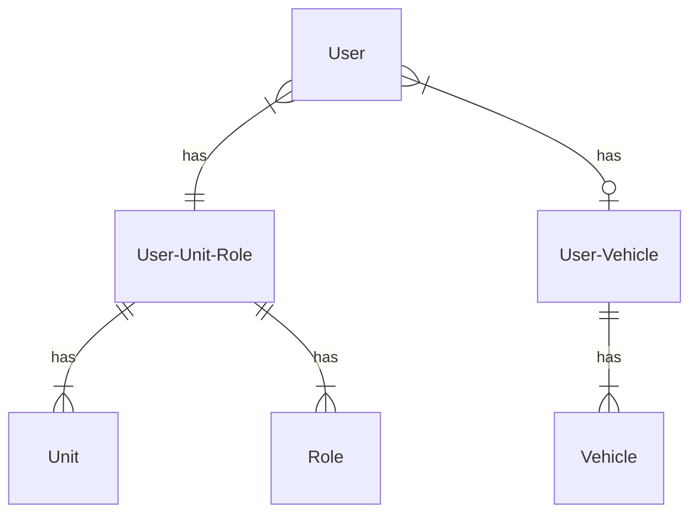
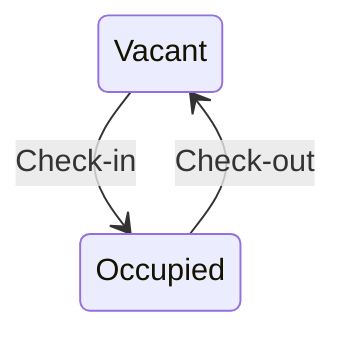

# Villas
Udacity Full Stack Development nano degree capstone project

## What is Villas
Resort communities often have homes or cabins grouped together in centrally managed communities. We call the properties within these communities _villas_. A villa may be a detached home or an apartment. Often a villa will have fractional ownership and sometimes they can be rented.

Villas is a tool for managing a community of villas. It allows people to check-in or check-out of their properties, connect vehicles to their properties and communicate general notices to owners.

## Actors
### Property Manager
A property manager can:
* read the current status of any _unit_ in their community. 
* add and remove owners from a _unit_ in the community.

### Unit Owner
A _unit owner_ can:
* check-in to and check-out of their _unit_.
* add a _vehicle_ to their _unit_

## Object Types
### User
A user of the system. 

_Property managers_ and _unit owners_ are roles that a _user_ can have. A _user_ can have both roles.

### Role
A user's role with respect to a unit. This determines how the user interacts with each unit.

For example a Property Manager user maybe a _unit owner_ of the unit they live in and they are _property manager_ of all of the units in their community.

### Unit
A villa property within a specific community. Units are owned by a _unit owner_. A _unit owner_ can have many _units_. An _unit_ can have many _unit owners_.

A unit has two states:
* vacant
* occupied

### Vehicle
A motorized vehicle that requires a parking stall within the community. A _vehicle_ is owned by a _unit owner_ and associated to a _unit_. A _unit_ can have many _vehicles_ and a _unit owner_ can have many _vehicles_.

## Main Use Cases
### Check-In
A _unit owner_ checks-in to their _unit_ to change the unit's status from _vacant_ to _occupied_. Any owner of a unit can check-in to a unit but only one owner may be checked in at a time.

### Check-Out
A _unit owner_ checks-out of their _unit_ to change the unit's status from _occupied_ to _vacant_. Only the unit owner who checked-in can check-out. 

### Add Unit Owner
A _manager_ can grant a _user_ the role of _unit owner_ for a specific unit.

### Remove Unit Owner
A _manager_ can remove a _user_ from the role of _unit owner_ for a specific unit.

### Add Vehicle
A _unit owner_ can add a vehicle to thier _unit_.

### Change Vehicle
A _unit owner_ can update their vehicle's make, model or license plate.

### Remove Vehicle
A _unit owner_ can remove a vehicle from thier _unit_.

## Enitity Relationships

## State Transitions
### Unit States
